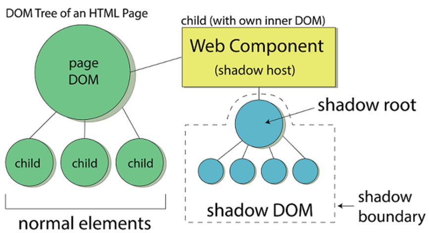

# research-microfontend

## 簡介

微前端 ( Micro Frontend ) 是一種架構樣式 ( Architecture Pattern )，其設計原理源自於 Micro Services，目的是將整體前端應用程式分解，使其達到耦合鬆散與獨立部屬。


> from [Micro Frontends - extending the microservice idea to frontend development](https://micro-frontends.org/)，Monolithic Frontends

由如上圖所示，從早期的 Monoith 系統至 Microservice 的演變，這過程中前端 ( Frontend ) 考量用戶操作的流暢度仍保留單頁應用程式 ( SPA、Single Page Application ) 設計，這導致當前端開發功能越多越複雜時，將使前端本身就成為一個難以維護的 Monoith 系統；而若考量 Microservice 設計概念，則應如下圖，基於垂直組織化，將前端與後端視為單一系統的模塊區分，在最終不改變用戶操作流暢度的前提下，做到動態掛入服務模組。


> from [Micro Frontends - extending the microservice idea to frontend development](https://micro-frontends.org/)，Organisation in Verticals

然而，微服務 ( Micro Services ) 透過 API Gateway 可以使其看似一體，而微前端 ( Micro Fontend ) 則必須在瀏覽器端看似一體，可近年因為前端框架 React、Vue、Angular 的崛起，使得前端編譯後的程式是否可混合使用，這是一個值得令人深思的架構議題；但這樣的設計概念，對大型前端專案而言具有以下優勢：

+ 分步版本重構
+ 分散編譯時間
+ 分次載入系統
+ 分批更新軟體

在已知的做法中，共有一下方法達到微前端設計：

+ Single-Spa
+ Webpack Module Federation
+ Iframes and Web Components
+ Custom Solutions and Integration with Existing Frameworks

## 設計議題

### Pure JavaScript

+ [範本程式](./app/pure)
    - [範例網址：localhost:8080](http://localhost:8080/)
+ 命令指令：
    - ```mf pure```：啟動範本伺服器
    - ```mf pure into```：進入範本伺服器
    - ```mf pure rm```：移除範本伺服器

基於 Pure JavaScript 的基礎 ```<script>``` 標籤，確認載入函數的基礎外部腳本會產生的原則。

+ 同名覆蓋
在 JavaScript 原生規則下，函數名稱相同，後載入的會覆蓋前者。

+ 宣告於 Window
在 JavaScript 原生規則下，函數載入後會宣告在 window 下，可以至 Console 中輸入 ```window.add``` 來確認函數結果


若使用 ```<script type="module">``` 標籤，則匯入的檔案會基於 ES6 模塊規則匯入 ( import )，若為將匯入物件指定給 window，則物件將無法經由 window 提取；反之，若再匯入後指定給 window，則可依據其設計添加至指定的進入點，便於後續對物件存取。

+ [<script>: type attribute](https://developer.mozilla.org/en-US/docs/Web/HTML/Element/script/type)
    - [JavaScript modules - MDN](https://developer.mozilla.org/en-US/docs/Web/JavaScript/Guide/Modules)
    - [SCRIPT 標籤與模組](https://openhome.cc/zh-tw/javascript/script/module/)


此外，由於匯入並指定給 Window 的方式有所差別，可以看到指定後的物件結構並不相同。

+ ```window.m1``` 是在模組檔案最尾端添加，這樣使用模組在 window 的名稱為固定
+ ```window.m2``` 是在模組匯入後由 index.html 內添加進 window，這樣使用模組在 window 的名稱可於載入後再決定

### Web component

+ [範本程式](./app/webcom)
    - [範例網址：localhost:8081](http://localhost:8081/)
+ 命令指令：
    - ```mf webcom```：啟動範本伺服器
    - ```mf webcom into```：進入範本伺服器
    - ```mf webcom rm```：移除範本伺服器


> from [Web Components and Types it’s Includes in LWC](https://jayakrishnasfdc.wordpress.com/2020/11/29/web-components-and-types-its-includes-in-lwc/)

Web Component 是基於 [HTMLElement](https://developer.mozilla.org/en-US/docs/Web/API/HTMLElement) 的 DOM API，以此封裝 HTML、CSS、JS 設定與行為，從而完成具有獨立可重複利用的元件；而構成其封裝，主要有三個功能：

+ Custom Elements：用於宣告繼承 HTMLElement 的類別，實際在 DOM 中的標籤名稱
+ Shadow DOM：另 HTMLElement 具有自己的 DOM Tree，並確 HTMLElement 中的 HTML、CSS、JS 僅影響自身的 DOM
+ HTML Templates：透過載入額外宣告的 HTML 樣板，替代 HTMLElement 內經由 DOM API 逐個建立的 DOM 內容

對於 Web Component 其他的功能與運用可以參考 MDN 在 [web-components-examples](https://github.com/mdn/web-components-examples/) 中的範例，而其中最主要的設計是 Shadow DOM，基於以下特性，可令其成為 [iframe](https://developer.mozilla.org/en-US/docs/Web/HTML/Element/iframe) 替代解決方案：

+ Isolated DOM：隔絕性，Shadow DOM 可視為 DOM 中的 DOM，因保有自身的 DOM Tree，使其下的 HTML、CSS、JS 可與上層的 DOM 隔離。
+ Scoped CSS：因隔絕性，Shadow DOM 中定義的 CSS 作用範圍僅限 Shadow DOM。
+ Composition：因隔絕性，Shadow DOM 內的 DOM Tree 獨立於外，因此，可基於 ```<select>```、```<form>``` 等元素構成期望的互動行為。

嚴格來說，Web Component 是 ```<script type="module">``` 的一種延伸運用，先透過 es6 模組的獨立性載入程式，在程式載入完畢後宣告自身類別對應的元素名稱，並基於其自身 Shadwo DOM 特性，做到內部獨立的特性，從而讓整個 HTML 主頁能反覆利用該元素。

而範本程式主要基於前述三功能設計：

+ ```com-1```，基於 HTMLElement 宣告類別，並新增元素至畫面
    - 本範例內宣告 ```<style>``` 於此，可以發現此處宣告的樣式影響了整體的 ```div``` 文字顏色
+ ```com-2```，基於 HTMLElement 宣告類別，並新增元素至自身的 Shadwo DOM 中
    - 本範例內宣告 ```<style>``` 於此，可以可以發現此處宣告的樣式僅影響了 Shadow DOM 中的 ```div``` 文字顏色
+ ```com-3```，基於 HTMLElement 宣告類別，並將外部的 HTML 樣式添加自 Shadwo DOM 中

### Webpack

+ [範本程式](./app/webpack)
    - [範例網址：localhost:8082](http://localhost:8082/)
+ 命令指令：
    - ```mf webpack base```：啟動範本伺服器，伺服器內容來源於編譯 Webpack 專案
    - ```mf webpack base rm```：移除範本伺服器
    - ```mf webpack base dev```：啟動開發環境容器，並以 bash 進入容器內
    - ```mf webpack base serve```：啟動 Webpack 開發伺服器
    - ```mf webpack base dev```：編譯 Webpack 專案

基於 Webpack 進行 JavaScript 封裝，本質上，藉由 Webpack 的封裝並未於直接撰寫有何差別，只是 Webpack 可提供諸如開發伺服器、JS 與 CSS 整合與壓縮，這些常用的開發工具與產品化處理流程；若配合 Webpack 的 [Multiple Entry Points](https://webpack.js.org/concepts/output/#multiple-entry-points)，可針對各個 Web Component 進行編譯與獨立輸出，並自動合併至 HTML 主頁中。

### Multiple Frontend Framework

基於不同前端框架的範本建立

+ [範本程式](./app/mff)
    - [範例網址：localhost:8083](http://localhost:8083/)
+ 命令指令：
    - ```mf mff```：啟動範本伺服器，伺服器內容來源於編譯 Webpack 專案
    - ```mf mff rm```：移除範本伺服器

### Webpack Module Federation

基於 Webpack Module Federation 設計原理，建立不同前端框架的範本混用：

+ 基礎封裝 base 與存取原則
    + 模組登記、搜尋、取回方式
+ 基於框架的 web component
    + React 不同版本
    + React、Vue、Angular 框架混用

其設計應注意以下可能問題：

+ 多個封裝、分次載入運作
+ 一個頁面動態載入多個框架程式是否會有 JS 衝突
+ 如何正確呼叫到指定框架的內容

### Single-Spa

基於前述範本，使用 Single-Spa 框架。

## 文獻

+ [A Comprehensive Guide to Micro Frontend Architecture](https://medium.com/appfoster/a-comprehensive-guide-to-micro-frontend-architecture-cc0e31e0c053)
    - [Web Components - MDN ](https://developer.mozilla.org/en-US/docs/Web/API/Web_components)
        + [Micro Frontends - extending the microservice idea to frontend development](https://micro-frontends.org/)
        + [web-components-examples - MDN Github](https://github.com/mdn/web-components-examples/)
        + [Styling a Web Component](https://css-tricks.com/styling-a-web-component/)
        + [Web Component 學習筆記](https://johnnywang1994.github.io/book/articles/js/web-component.html)
        + [Shadow DOM ：獨立的Web組件](https://www.gss.com.tw/blog/shadow-dom-%EF%BC%9A%E7%8D%A8%E7%AB%8B%E7%9A%84web%E7%B5%84%E4%BB%B6)
        + iframe vs web component
            - [iFrames and Web Components | Thoughtful technologies](https://www.factorial.io/en/blog/building-towards-reusable-modular-web-iframes-and-web-components)
            - [Removing iframe and Switching to Web Component for the Most Popular PDF Viewer](https://apryse.com/blog/replacing-iframe-to-web-component)
    - [HTML <iframe> Tag - w3schools](https://www.w3schools.com/tags/tag_iframe.ASP)
        + [The Strengths and Benefits of Micro Frontends](https://www.toptal.com/front-end/micro-frontends-strengths-benefits)
    - [Module Federation - Webpack](https://webpack.js.org/concepts/module-federation/)
        + [微服務很夯，那你有聽過微前端嗎？初探 Micro Frontends 程式架構](https://medium.com/starbugs/e0a8469be601)
        + [[architecture] Micro-Frontends](https://pjchender.dev/system-design-and-architecture/architecture-udemy-microfrontend/)
+ [single-spa](https://single-spa.js.org/)
    - [Concept: Microfrontends](https://single-spa.js.org/docs/microfrontends-concept/)
